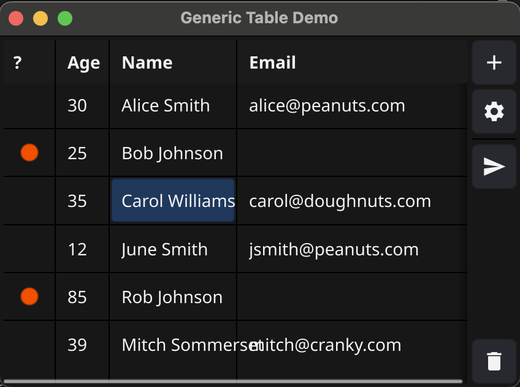

# fyne-components
A set of generic application components that do useful things.

## Editable list/table

A utility component that accepts an array of items and renders them in a table with columns.
Create, edit, and delete controls are provided along with the option to render simple shapes
as status icons.

You can provide custom actions that operate on selected items along with predicates that disable them for items that don't qualify.

A copy facility waits for Ctrl-C and then renders the columns to the clipboard as CSV entries.
